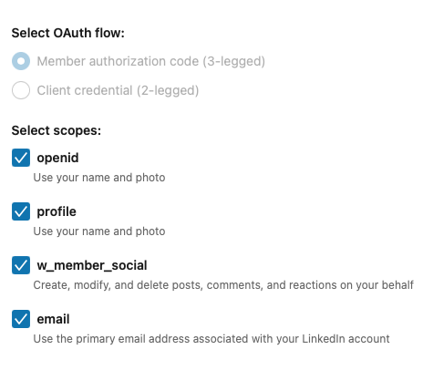

# LinkedSky: Post to LinkedIn and Bluesky programmatically
When X was still Twitter it offered a public API. That made it possible to create a post on LinkedIn and configure
LinkedIn to also post the same content to Twitter. This is not possible anymore, so I've decided to move to Bluesky and
write a program that supports posting to both platforms using their APIs.

## LinkedIn integration
Getting access to LinkedIn's API is a bit tricky. First, you need to create a new company page and verify it. Then,
you have to [create an app](https://www.linkedin.com/developers/apps?appStatus=active) that belongs to the specific 
company. You can use the app to create long-lived tokens for accessing the REST API.

**Note**: When [generating a token](https://www.linkedin.com/developers/tools/oauth/token-generator), make sure to 
give it all available OAuth 2.0 scopes, as shown below 

Once you have a token, you can use it to interact with the REST API. Execute a `GET` request on 
https://api.linkedin.com/v2/userinfo to test it. Keep a copy of the `sub` property, you'll need it to be able to
use `LinkedSky`.

### References
[LinkedIn API access documentation](https://www.linkedin.com/help/linkedin/answer/a526048/accessing-linkedin-apis?lang=en)

## Bluesky integration
To use the Bluesky API all you need is an account. You can use your account's credentials to receive access tokens, but
this part is conveniently managed by the SDK, when using it.

### References
[Bluesky SDK documentation](https://docs.bsky.app/docs/get-started)

## Usage
You are advised to create a virtual environment, to avoid messing with your system's Python:
```bash
python -m venv linkedskyenv
source linkedskyenv/bin/activate
pip install -r requirements.txt
```

Create a `.env` file and define the following variables (replace the `[]` placeholders):
```text
LINKEDIN_AUTHOR=urn:li:person:[SUB]
LINKEDIN_TOKEN=[TOKEN]
BSKY_USER=[USER]
BSKY_PASS=[PASSWORD]
```

LinkedSky is an interactive terminal application, and starting it is a matter of executing `python linkedsky.py`.
